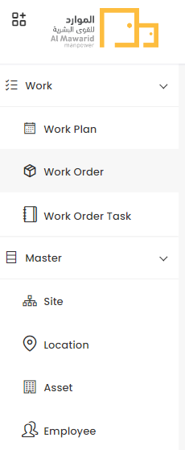
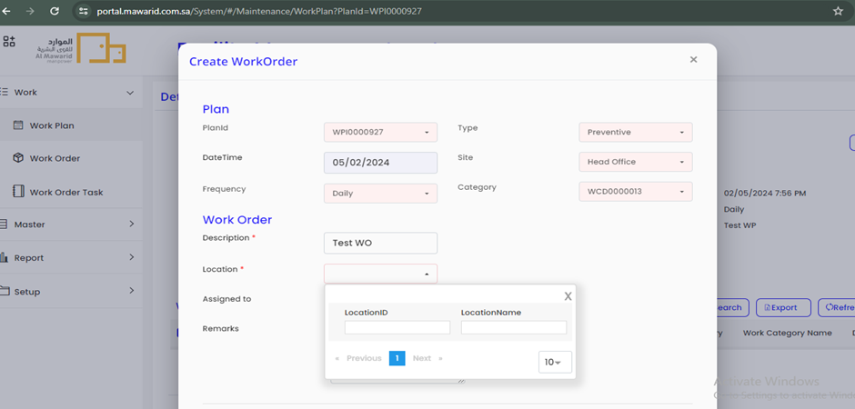
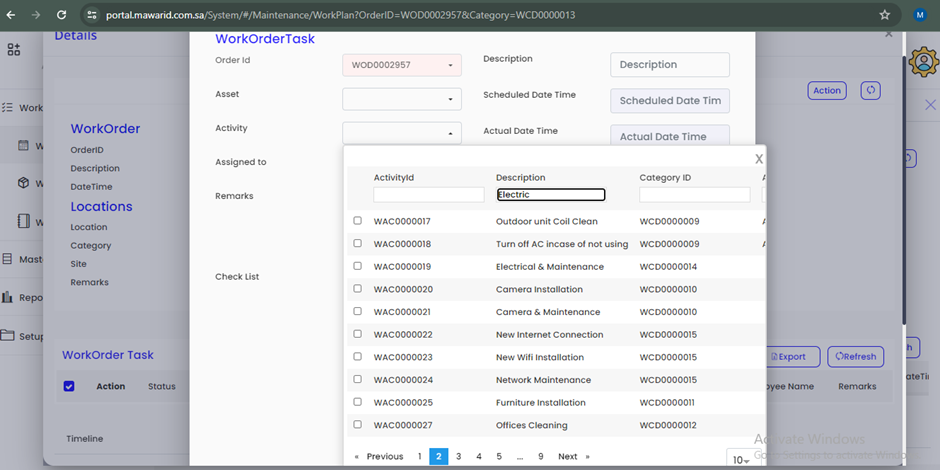
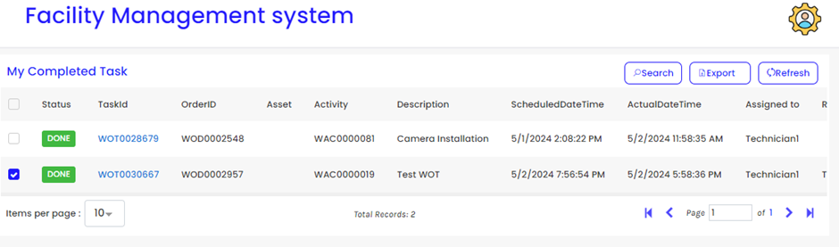
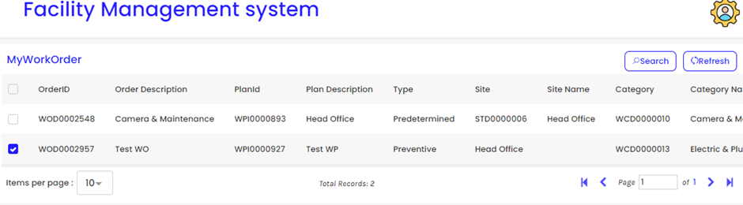
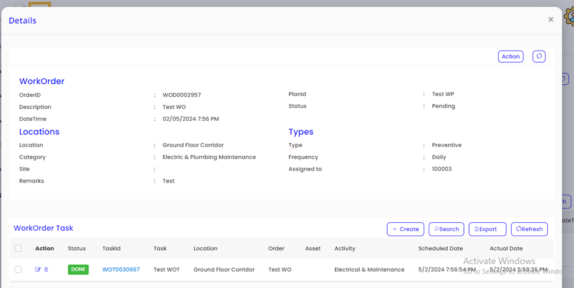
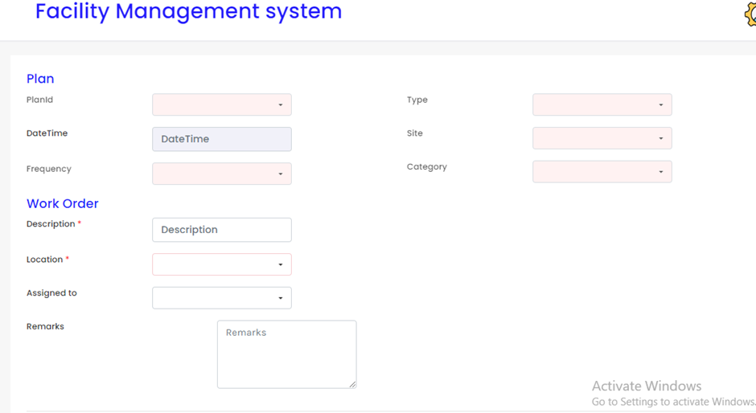
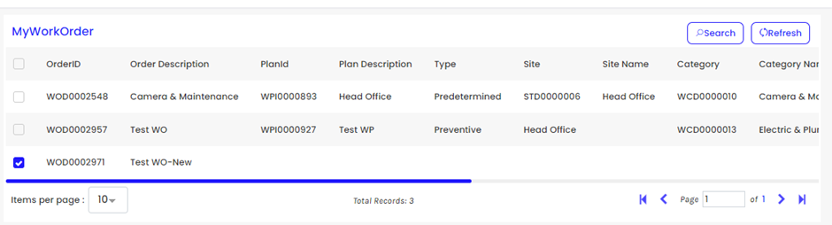
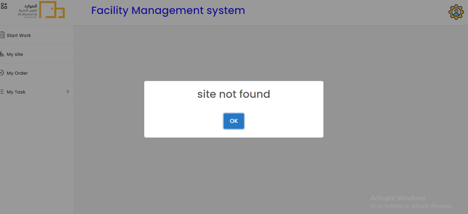

## Facility Management System - Issues

  *	Other menus are not closing automatically when opening a new menu

  

  * Location dropdown is not showing the data without searching in Work Order Create.

  

  * WorkOrderTask Create > Activity dropdown > Activity Id & Description search is not working

  

  * The Selected task status was "DONE" But In the My order list, it’s status is still "PENDING".

  

  

  * In Work Order details page from admin user side, Work Order Task’s Status is “Done” But the Work Order status is still “Pending”.

  

  * (In Technician Login) – Start Work > Head Office > Work Order Create – Not patching the data in PlanId, Frequency, Type, Site & Category.

  

  *	By Creating the Work Order by using the above form, only WorkOrder is created there is no anyother ways to create Work Order Task by the Technician & No details regarding the work order task.

  

  *	This Error message is often showing in all the pages (Technician Login)

  